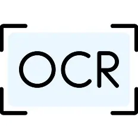

# 📝 Resume OCR Extraction

Automate the extraction of crucial data from resumes using advanced Optical Character Recognition.





## ✨ Features

*   **Accurate OCR Processing:** Leverage state-of-the-art OCR technology to reliably extract text from diverse resume formats, including scanned documents and PDFs.
*   **Structured Data Extraction:** Automatically identify and extract key information such as names, contact details, work experience, education, and skills into a structured format.
*   **Efficient Document Handling:** Designed for batch processing, allowing you to quickly process multiple resumes and streamline your recruitment workflow.
*   **Modular Design:** Built with a modular architecture, making it easy to extend, customize, and integrate with existing HR systems or other data pipelines.
*   **Sample Dataset Included:** Comes with a pre-packaged `OCR Resumes Dataset` for easy testing, development, and demonstration purposes.


## 🛠️ Installation Guide

Follow these steps to set up and run the Resume-OCR-extraction project on your local machine.

### Prerequisites

*   Python 3.8+
*   pip (Python package installer)
*   git

### 1. Clone the Repository

First, clone the project repository from GitHub:

```bash
git clone https://github.com/rithaa24/Resume-OCR-extraction.git
cd Resume-OCR-extraction
```

### 2. Create a Virtual Environment

It's highly recommended to use a virtual environment to manage dependencies:

```bash
python -m venv venv
```

### 3. Activate the Virtual Environment

Activate the virtual environment.

**On Windows:**

```bash
.\venv\Scripts\activate
```

**On macOS/Linux:**

```bash
source venv/bin/activate
```

### 4. Install Dependencies

Install the required Python packages. This project relies on the `doctr` library for OCR.

```bash
pip install -r requirements.txt
```

*(Note: A `requirements.txt` file is assumed for standard Python projects. If not present, create one with `doctr` and other necessary libraries.)*

```
# Example requirements.txt content:
# doctr[torch]  # or doctr[tensorflow] depending on your backend preference
# Pillow
# opencv-python
# numpy
```


## 🚀 Usage Examples

Once installed, you can use the scripts to perform OCR and data extraction on your resumes.

### Basic OCR Extraction

To run the basic OCR process on a single resume:

```bash
python ocr.py --input_path "path/to/your/resume.pdf" --output_dir "output/"
```

### Doctr-based Information Extraction

To use the `doctr_extraction.py` script for more structured information extraction:

```bash
python doctr_extraction.py --input_path "path/to/your/resume.png" --output_format "json"
```

Replace `"path/to/your/resume.pdf"` or `"path/to/your/resume.png"` with the actual path to your resume file. The `--output_dir` specifies where to save the extracted data.

### Example Output (JSON format)

```json
{
  "name": "John Doe",
  "email": "john.doe@example.com",
  "phone": "+1-123-456-7890",
  "experience": [
    {
      "title": "Software Engineer",
      "company": "Tech Solutions Inc.",
      "duration": "2020 - Present"
    }
  ],
  "education": [
    {
      "degree": "B.Sc. Computer Science",
      "university": "State University",
      "year": "2019"
    }
  ],
  "skills": ["Python", "Machine Learning", "OCR"]
}
```


## 🛣️ Project Roadmap

We have exciting plans for the future development of Resume-OCR-extraction:

*   **V1.1 - Enhanced Accuracy & Format Support:**
    *   Improve OCR accuracy for handwritten sections and complex resume layouts.
    *   Add support for additional input formats (e.g., DOCX).
*   **V1.2 - Advanced Entity Recognition:**
    *   Implement more sophisticated Named Entity Recognition (NER) for better extraction of less common fields.
    *   Integrate with external APIs for validation of extracted data (e.g., company names).
*   **V1.3 - Web Interface & API:**
    *   Develop a user-friendly web interface for easy resume upload and data visualization.
    *   Provide a RESTful API for seamless integration with other applications.
*   **Future - Cloud Integration & Scalability:**
    *   Explore cloud-native deployment options for highly scalable processing.
    *   Integrate with popular HR platforms for direct resume ingestion.


## 🤝 Contribution Guidelines

We welcome contributions to the Resume-OCR-extraction project! To ensure a smooth collaboration, please follow these guidelines:

### Code Style

*   Adhere to [PEP 8](https://www.python.org/dev/peps/pep-0008/) for Python code style.
*   Use clear and concise variable/function names.
*   Include docstrings for all functions and classes.

### Branch Naming Conventions

*   `main`: The stable production branch.
*   `develop`: The primary development branch.
*   `feature/<feature-name>`: For new features.
*   `bugfix/<issue-number>`: For bug fixes.
*   `hotfix/<issue-number>`: For urgent bug fixes on `main`.

### Pull Request Process

1.  **Fork** the repository and clone it locally.
2.  **Create a new branch** from `develop` for your feature or bug fix.
3.  **Make your changes**, ensuring they align with the project's goals.
4.  **Test your changes** thoroughly.
5.  **Commit your changes** with descriptive commit messages.
6.  **Push your branch** to your forked repository.
7.  **Open a Pull Request** (PR) to the `develop` branch of the main repository.
8.  **Provide a clear description** of your changes in the PR, referencing any relevant issues.
9.  **Be responsive** to feedback during the review process.

### Testing Requirements

*   All new features should be accompanied by appropriate unit and/or integration tests.
*   Ensure that existing tests pass before submitting a pull request.


## 📜 License Information

This project is currently **Unlicensed**.

As there is no specific license provided, standard copyright law applies. This means that, by default, all rights are reserved by the copyright holder(s) (rithaa24), and you may not reproduce, distribute, or create derivative works from this project without explicit permission.

For any inquiries regarding licensing or usage, please contact the main contributor.

Copyright (c) 2025 rithaa24
